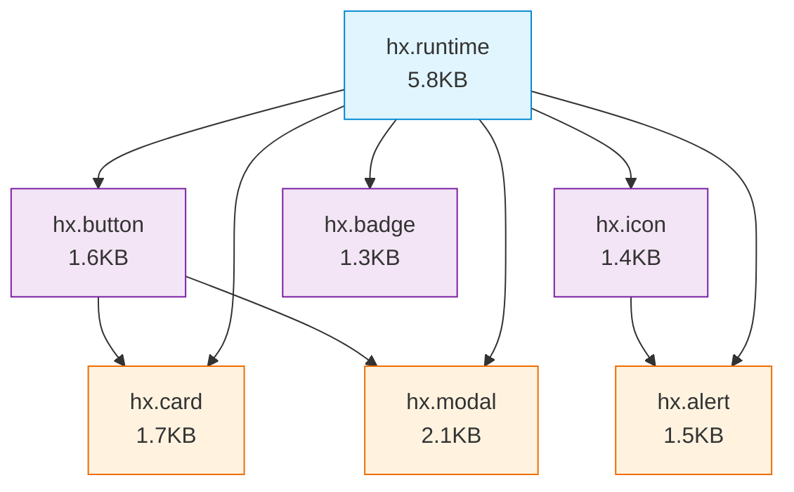

This document provides a complete implementation guide for **per-component loading** — the recommended strategy from ADR-002 for loading HELIX web components in Drupal. This approach treats each component as an independent Drupal library, enabling surgical payload control and maintaining a strict performance budget of <50KB per page.

## Executive Summary

**The Problem**: Loading all 44 HELIX components on every page costs ~80KB (Brotli), violating performance budgets and penalizing simple pages.

**The Solution**: Each component is a separate Drupal library. Pages load only the components they render. Drupal's dependency system handles deduplication and load order.

**The Result**: Typical pages load 14-35KB instead of 80KB. Cache invalidation is per-component. The library scales to 100+ components without degrading performance.

**The Trade-off**: 44 library definitions and PHP preprocess functions instead of one global script tag.

## Why Per-Component Loading

### Performance Budget Enforcement

Enterprise healthcare pages have strict JavaScript budgets:

| Budget Item                  | Allocation | Notes                                                 |
| ---------------------------- | ---------- | ----------------------------------------------------- |
| Total page JS                | <100KB     | Entire page including Drupal core, contrib, analytics |
| HELIX library budget         | <50KB      | Components should consume ≤50% of JS budget           |
| Lit runtime (shared)         | ~5.8KB     | Loaded once, cached indefinitely                      |
| Design tokens CSS            | ~0.5KB     | Loaded once                                           |
| Per-component average target | ~1.5KB     | Allows 25-30 components per page within budget        |

**Single bundle approach**: Every page loads 80KB regardless of content.
**Per-component approach**: Article teaser page loads ~14KB (Lit + button + card).

### Tree-Shaking via Drupal Libraries

Traditional JavaScript bundlers tree-shake at build time by analyzing imports. Drupal has no build step at deployment time — it serves pre-built files. The library system IS the tree-shaking mechanism.

```yaml
# This is Drupal's equivalent of tree-shaking
# Only attached libraries are loaded
{{ attach_library('mytheme/hx.button') }}
{{ attach_library('mytheme/hx.card') }}
# hx-modal, hx-accordion, hx-table, and 41 other components are NOT loaded
```

Drupal's asset resolver:

1. Collects all `attach_library()` calls for the page
2. Resolves transitive dependencies
3. Deduplicates (if both card and modal depend on button, button loads once)
4. Aggregates files in production (combines into 2-4 optimized bundles)

### Cache Efficiency

**Monolithic bundle**:

- Cache key: Hash of entire 80KB bundle
- Invalidates: When ANY of 44 components changes
- Impact: Every visitor re-downloads 80KB on every release

**Per-component loading**:

- Cache keys: One per component (44 entries + runtime + tokens = 46 total)
- Invalidates: Only the changed component
- Impact: Updating `hx-tooltip` = 1.3KB re-download, not 80KB

Over a 12-month period with biweekly releases:

- Monolithic: ~1.9GB total downloads per returning visitor (24 × 80KB)
- Per-component: ~120MB total downloads (8 updated components × 1.5KB × 24 releases)

16x bandwidth savings for returning visitors.

### Scalability

Adding the 45th component:

- **Monolithic**: Bundle grows to ~82KB. Every page pays the penalty.
- **Per-component**: Pages using the new component load +1.5KB. Pages not using it: +0KB.

At 100 components:

- **Monolithic**: ~180KB Brotli. Untenable.
- **Per-component**: Still 14-35KB per page (same as with 44 components).

Per-component loading has no ceiling.

## Architecture Overview

### The Three-Tier Structure

```
┌─────────────────────────────────────────────────────┐
│  1. RUNTIME LIBRARY (hx.runtime)                    │
│     - Lit core (~5.8KB Brotli)                      │
│     - Design tokens CSS (~0.5KB)                    │
│     - Loaded once, cached indefinitely              │
│     - Required by all component libraries           │
└─────────────────────────────────────────────────────┘
                         ▲
                         │ (dependency)
                         │
┌─────────────────────────────────────────────────────┐
│  2. PER-COMPONENT LIBRARIES (44 total)              │
│     - hx.button, hx.card, hx.text_input, etc.       │
│     - Each: ~1.3-2.5KB Brotli                       │
│     - Explicit dependencies (card depends on button)│
│     - Atomic loading unit                           │
└─────────────────────────────────────────────────────┘
                         ▲
                         │ (aggregated by)
                         │
┌─────────────────────────────────────────────────────┐
│  3. CONVENIENCE GROUPS (optional)                   │
│     - hx.group_core, hx.group_forms, etc.           │
│     - Pure dependency aggregators (no JS)           │
│     - Simplify common patterns                      │
│     - Used in preprocess functions                  │
└─────────────────────────────────────────────────────┘
```

### Load Flow for a Typical Article Page

```
User requests /node/123 (Article)
    ↓
Drupal renders node--article--full.html.twig
    ↓
Template attaches: {{ attach_library('mytheme/hx.card') }}
    ↓
Drupal's asset resolver traces dependencies:
  hx.card → depends on → hx.button
  hx.card → depends on → hx.runtime
  hx.button → depends on → hx.runtime
    ↓
Deduplication: hx.runtime appears twice, load once
    ↓
Aggregation (production mode):
  Combine: hx.runtime.js + hx.button.js + hx.card.js
  Into: aggregate-abc123.js (~14KB Brotli)
    ↓
HTML output:
  <script type="module" src="/sites/default/files/js/aggregate-abc123.js"></script>
    ↓
Browser loads, parses, registers 3 custom elements:
  customElements.define('hx-button', HxButton)
  customElements.define('hx-card', HxCard)
    ↓
Components upgrade, content becomes interactive
```

Total payload: 14KB Brotli (runtime + 2 components) vs 80KB full bundle.

## Complete Implementation

### Step 1: Runtime Library Definition

Every HELIX integration starts with the runtime library. This is the shared foundation.

```yaml
# mytheme.libraries.yml

# ─────────────────────────────────────────────────────
# HELIX Runtime — Shared Dependencies
# ─────────────────────────────────────────────────────
# The Lit runtime and design tokens. Required by all
# component libraries. Loaded once per page, cached
# indefinitely (changes only when Lit version updates).

hx.runtime:
  version: 1.0.0
  css:
    theme:
      # Design tokens: CSS custom properties for theming
      vendor/helix/tokens.css:
        minified: true
  js:
    # Lit core (lit + lit/decorators + lit/directives)
    # Externalized from component builds
    vendor/helix/lit-runtime.js:
      type: module
      minified: true
      preprocess: false
      attributes:
        crossorigin: anonymous
  dependencies:
    # No dependencies — this is the foundation
```

**File structure**:

```
themes/custom/mytheme/
└── vendor/
    └── helix/
        ├── lit-runtime.js      (~16.8KB raw, ~5.8KB Brotli)
        └── tokens.css          (~2.1KB raw, ~0.5KB Brotli)
```

### Step 2: Per-Component Library Definitions

Each component gets its own library entry with explicit dependencies.

```yaml
# mytheme.libraries.yml (continued)

# ─────────────────────────────────────────────────────
# HELIX Components — Per-Component Libraries
# ─────────────────────────────────────────────────────
# Each component is a separate library. Drupal's asset
# system handles deduplication and load order.

# ─── Atoms ───

hx.button:
  version: 1.0.0
  js:
    vendor/helix/components/hx-button/index.js:
      type: module
      minified: true
      preprocess: false
  dependencies:
    - mytheme/hx.runtime

hx.icon:
  version: 1.0.0
  js:
    vendor/helix/components/hx-icon/index.js:
      type: module
      minified: true
      preprocess: false
  dependencies:
    - mytheme/hx.runtime

hx.badge:
  version: 1.0.0
  js:
    vendor/helix/components/hx-badge/index.js:
      type: module
      minified: true
      preprocess: false
  dependencies:
    - mytheme/hx.runtime

hx.spinner:
  version: 1.0.0
  js:
    vendor/helix/components/hx-spinner/index.js:
      type: module
      minified: true
      preprocess: false
  dependencies:
    - mytheme/hx.runtime

# ─── Form Components ───
# Form elements depend on the runtime only

hx.text_input:
  version: 1.0.0
  js:
    vendor/helix/components/hx-text-input/index.js:
      type: module
      minified: true
      preprocess: false
  dependencies:
    - mytheme/hx.runtime

hx.textarea:
  version: 1.0.0
  js:
    vendor/helix/components/hx-textarea/index.js:
      type: module
      minified: true
      preprocess: false
  dependencies:
    - mytheme/hx.runtime

hx.select:
  version: 1.0.0
  js:
    vendor/helix/components/hx-select/index.js:
      type: module
      minified: true
      preprocess: false
  dependencies:
    - mytheme/hx.runtime

hx.checkbox:
  version: 1.0.0
  js:
    vendor/helix/components/hx-checkbox/index.js:
      type: module
      minified: true
      preprocess: false
  dependencies:
    - mytheme/hx.runtime

hx.radio_group:
  version: 1.0.0
  js:
    vendor/helix/components/hx-radio-group/index.js:
      type: module
      minified: true
      preprocess: false
  dependencies:
    - mytheme/hx.runtime

hx.switch:
  version: 1.0.0
  js:
    vendor/helix/components/hx-switch/index.js:
      type: module
      minified: true
      preprocess: false
  dependencies:
    - mytheme/hx.runtime

# ─── Molecules ───
# Molecules may depend on atoms they use internally

hx.card:
  version: 1.0.0
  js:
    vendor/helix/components/hx-card/index.js:
      type: module
      minified: true
      preprocess: false
  dependencies:
    - mytheme/hx.runtime
    - mytheme/hx.button # Cards often have button CTAs in actions slot

hx.alert:
  version: 1.0.0
  js:
    vendor/helix/components/hx-alert/index.js:
      type: module
      minified: true
      preprocess: false
  dependencies:
    - mytheme/hx.runtime
    - mytheme/hx.icon # Alerts show icons for variant (info, warning, etc.)

hx.breadcrumb:
  version: 1.0.0
  js:
    vendor/helix/components/hx-breadcrumb/index.js:
      type: module
      minified: true
      preprocess: false
  dependencies:
    - mytheme/hx.runtime

# ─── Organisms ───
# Organisms compose multiple components

hx.modal:
  version: 1.0.0
  js:
    vendor/helix/components/hx-modal/index.js:
      type: module
      minified: true
      preprocess: false
  dependencies:
    - mytheme/hx.runtime
    - mytheme/hx.button # Modal footer actions use buttons

hx.accordion:
  version: 1.0.0
  js:
    vendor/helix/components/hx-accordion/index.js:
      type: module
      minified: true
      preprocess: false
  dependencies:
    - mytheme/hx.runtime
    - mytheme/hx.icon # Accordion uses chevron icons

hx.form:
  version: 1.0.0
  js:
    vendor/helix/components/hx-form/index.js:
      type: module
      minified: true
      preprocess: false
  dependencies:
    - mytheme/hx.runtime
    # Note: Does NOT depend on individual form fields
    # Form fields are loaded based on what's in the form

# ─── Continue for all 44 components ───
```

**Dependency Management Rules**:

1. **Runtime is universal** — Every component depends on `mytheme/hx.runtime`
2. **Atoms are independent** — No inter-component dependencies (button, icon, badge standalone)
3. **Molecules depend on atoms they use** — Card depends on button if card templates include button CTAs
4. **Organisms depend on constituent components** — Modal depends on button (footer actions)
5. **Container components are minimal** — Accordion container doesn't depend on accordion-item (slots are dynamic)

### Step 3: Convenience Group Libraries

Groups are pure dependency aggregators with NO JavaScript of their own.

```yaml
# mytheme.libraries.yml (continued)

# ─────────────────────────────────────────────────────
# HELIX Convenience Groups
# ─────────────────────────────────────────────────────
# These libraries contain NO JavaScript. They are pure
# dependency lists that load common component sets.
# Use these in preprocess functions for cleaner code.

hx.group_core:
  version: 1.0.0
  # No js: or css: — pure dependency aggregator
  dependencies:
    - mytheme/hx.button
    - mytheme/hx.icon
    - mytheme/hx.badge
    - mytheme/hx.spinner

hx.group_forms:
  version: 1.0.0
  dependencies:
    - mytheme/hx.text_input
    - mytheme/hx.textarea
    - mytheme/hx.select
    - mytheme/hx.checkbox
    - mytheme/hx.radio_group
    - mytheme/hx.switch
    - mytheme/hx.group_core # Forms use buttons for submit

hx.group_content:
  version: 1.0.0
  dependencies:
    - mytheme/hx.card
    - mytheme/hx.alert
    - mytheme/hx.prose
    - mytheme/hx.group_core # Content uses buttons, badges

hx.group_interactive:
  version: 1.0.0
  dependencies:
    - mytheme/hx.modal
    - mytheme/hx.accordion
    - mytheme/hx.group_core # Interactive widgets use icons

# ─── Development Bundle (NEVER in production) ───

hx.all:
  version: 1.0.0
  dependencies:
    - mytheme/hx.group_core
    - mytheme/hx.group_forms
    - mytheme/hx.group_content
    - mytheme/hx.group_interactive
    # This loads ALL components. Only use during development.
    # Remove before deployment.
```

### Step 4: TWIG Template Integration

Templates attach the libraries they need.

**Precise per-component attachment**:

```twig
{# node--article--teaser.html.twig #}

{# Attach only what this template uses #}
{{ attach_library('mytheme/hx.card') }}
{# hx.card depends on hx.button, so button loads automatically #}
{# hx.button depends on hx.runtime, so runtime loads automatically #}
{# Final payload: runtime + button + card = ~9KB Brotli #}

<article{{ attributes.addClass('node--article--teaser') }}>
  <hx-card
    heading="{{ label }}"
    href="{{ url }}"
    variant="{{ node.isPromoted() ? 'featured' : 'default' }}"
  >
    
      <div slot="media">{{ content.field_hero_image }}</div>
    

    {{ content.body }}

    
      <div slot="meta">{{ content.field_tags }}</div>
    

    <div slot="actions">
      <hx-button variant="text" href="{{ url }}">
        {{ 'Read More'|t }}
      </hx-button>
    </div>
  </hx-card>
</article>
```

**Group attachment for multi-component templates**:

```twig
{# webform--contact.html.twig #}

{# Attach the forms group instead of listing each field type #}
{{ attach_library('mytheme/hx.group_forms') }}
{# Loads: text-input, textarea, select, checkbox, radio, switch, button #}

<hx-form action="{{ form.action }}" method="post">
  {{ form.form_id }}
  {{ form.form_token }}

  {# All form components are now available #}
  <hx-text-input name="name" required>
    <label slot="label">{{ 'Your Name'|t }}</label>
  </hx-text-input>

  <hx-textarea name="message" required>
    <label slot="label">{{ 'Message'|t }}</label>
  </hx-textarea>

  <hx-select name="reason">
    <label slot="label">{{ 'Contact Reason'|t }}</label>
    <option value="">{{ '- Select -'|t }}</option>
    <option value="support">{{ 'Support'|t }}</option>
    <option value="sales">{{ 'Sales'|t }}</option>
  </hx-select>

  <hx-button type="submit" variant="primary">
    {{ 'Send Message'|t }}
  </hx-button>
</hx-form>
```

### Step 5: Preprocess Functions for Automated Attachment

Instead of managing libraries in every template, use preprocess functions for content type and paragraph type patterns.

```php
<?php

/**
 * @file
 * Theme preprocess functions for HELIX library attachment.
 */

/**
 * Implements hook_preprocess_node().
 *
 * Automatically attach HELIX component libraries based on content type
 * and view mode. This eliminates the need to add {{ attach_library() }}
 * in every node template.
 */
function mytheme_preprocess_node(array &$variables): void {
  $node = $variables['node'];
  $view_mode = $variables['view_mode'];
  $bundle = $node->bundle();

  // Content type + view mode → library mapping
  $node_libraries = [
    'article' => [
      'teaser' => [
        'mytheme/hx.card',
        // hx.card's dependencies (button, runtime) load automatically
      ],
      'full' => [
        'mytheme/hx.breadcrumb',
        'mytheme/hx.alert',  // For "Updated on" notices
        'mytheme/hx.group_content',  // For related articles section
      ],
    ],
    'page' => [
      'full' => [
        'mytheme/hx.breadcrumb',
        'mytheme/hx.prose',  // For formatted body content
      ],
    ],
    'event' => [
      'teaser' => ['mytheme/hx.card'],
      'full' => [
        'mytheme/hx.card',  // For related events
        'mytheme/hx.button',  // For register/RSVP buttons
        'mytheme/hx.alert',  // For event status messages
      ],
    ],
  ];

  if (isset($node_libraries[$bundle][$view_mode])) {
    foreach ($node_libraries[$bundle][$view_mode] as $library) {
      $variables['#attached']['library'][] = $library;
    }
  }
}

/**
 * Implements hook_preprocess_paragraph().
 *
 * Attach HELIX libraries based on paragraph type. Critical for
 * Layout Builder and Paragraphs module integration.
 */
function mytheme_preprocess_paragraph(array &$variables): void {
  $paragraph = $variables['paragraph'];
  $bundle = $paragraph->bundle();

  // Paragraph type → library mapping
  $paragraph_libraries = [
    // Simple paragraphs: single component
    'cta_button' => ['mytheme/hx.button'],
    'pull_quote' => ['mytheme/hx.alert'],
    'alert_message' => ['mytheme/hx.alert'],

    // Content display paragraphs
    'card_single' => ['mytheme/hx.card'],
    'card_grid' => [
      'mytheme/hx.card',
      'mytheme/hx.container',  // Grid wrapper
    ],

    // Interactive paragraphs: use groups
    'accordion_section' => ['mytheme/hx.accordion'],
    'faq_section' => ['mytheme/hx.accordion'],

    // Form paragraphs: load full form group
    'contact_form' => ['mytheme/hx.group_forms'],
    'newsletter_signup' => [
      'mytheme/hx.text_input',
      'mytheme/hx.checkbox',
      'mytheme/hx.button',
    ],
  ];

  if (isset($paragraph_libraries[$bundle])) {
    foreach ($paragraph_libraries[$bundle] as $library) {
      $variables['#attached']['library'][] = $library;
    }
  }
}

/**
 * Implements hook_preprocess_block().
 *
 * Attach HELIX libraries for specific block types.
 */
function mytheme_preprocess_block(array &$variables): void {
  $plugin_id = $variables['plugin_id'] ?? '';
  $derivative_id = $variables['derivative_plugin_id'] ?? '';

  $block_libraries = [
    'system_branding_block' => [],  // No WC components in branding
    'search_form_block' => [
      'mytheme/hx.text_input',
      'mytheme/hx.button',
    ],
    'system_menu_block' => [],  // Menus use standard markup
    'views_block' => [],  // Views handle their own library attachment
  ];

  // Menu-specific handling
  if ($plugin_id === 'system_menu_block') {
    // Primary navigation might use dropdown components
    if ($derivative_id === 'main') {
      $variables['#attached']['library'][] = 'mytheme/hx.button';
    }
  }

  if (isset($block_libraries[$plugin_id])) {
    foreach ($block_libraries[$plugin_id] as $library) {
      $variables['#attached']['library'][] = $library;
    }
  }
}

/**
 * Implements hook_preprocess_page().
 *
 * Attach page-level HELIX components. These are rarely content-type
 * specific and often render on every page.
 */
function mytheme_preprocess_page(array &$variables): void {
  // Always load breadcrumb component if breadcrumb region has content
  if (!empty($variables['page']['breadcrumb'])) {
    $variables['#attached']['library'][] = 'mytheme/hx.breadcrumb';
  }

  // Load core components used in site chrome
  $variables['#attached']['library'][] = 'mytheme/hx.group_core';
}

/**
 * Implements hook_preprocess_field().
 *
 * Attach libraries for specific field types or formatters.
 */
function mytheme_preprocess_field(array &$variables): void {
  $field_name = $variables['field_name'];
  $field_type = $variables['field_type'];

  // Example: Taxonomy term reference fields with "badge" formatter
  if ($field_type === 'entity_reference' && $variables['element']['#formatter'] === 'badge') {
    $variables['#attached']['library'][] = 'mytheme/hx.badge';
  }

  // Example: Link fields that should render as buttons
  if ($field_name === 'field_cta_link') {
    $variables['#attached']['library'][] = 'mytheme/hx.button';
  }
}
```

### Step 6: Bundle Size Budget Enforcement

Track payload size with a custom Drush command or CI check.

```php
<?php

/**
 * @file
 * Drush command to audit HELIX component payload per content type.
 */

namespace Drupal\mytheme\Commands;

use Drush\Commands\DrushCommands;
use Drupal\Core\Entity\EntityTypeManagerInterface;
use Drupal\Core\Render\RendererInterface;

/**
 * Drush commands for HELIX performance auditing.
 */
class HelixAuditCommands extends DrushCommands {

  /**
   * Audit HELIX component JavaScript payload by content type.
   *
   * @command helix:audit-payload
   * @aliases hx-audit
   */
  public function auditPayload(): void {
    $this->output()->writeln('HELIX Component Payload Audit');
    $this->output()->writeln('==============================');

    $budget_kb = 50;  // <50KB budget per page
    $violations = [];

    // Simulate rendering each content type/view mode
    $content_types = ['article', 'page', 'event'];
    $view_modes = ['teaser', 'full'];

    foreach ($content_types as $type) {
      foreach ($view_modes as $mode) {
        $libraries = $this->getAttachedLibraries($type, $mode);
        $total_size = $this->calculateLibrarySize($libraries);

        $this->output()->writeln(sprintf(
          '%s [%s]: %d libraries, %.2f KB',
          $type,
          $mode,
          count($libraries),
          $total_size
        ));

        if ($total_size > $budget_kb) {
          $violations[] = sprintf(
            '%s [%s] exceeds budget: %.2f KB > %d KB',
            $type,
            $mode,
            $total_size,
            $budget_kb
          );
        }
      }
    }

    if ($violations) {
      $this->output()->writeln("\n⚠️  BUDGET VIOLATIONS:");
      foreach ($violations as $violation) {
        $this->logger()->error($violation);
      }
      return self::EXIT_FAILURE;
    }

    $this->output()->writeln("\n✓ All content types within budget");
    return self::EXIT_SUCCESS;
  }

  /**
   * Get attached libraries for a content type/view mode.
   */
  private function getAttachedLibraries(string $type, string $mode): array {
    // Simulate preprocess logic or introspect attached libraries
    // Return array of library names
    return [];
  }

  /**
   * Calculate total size (Brotli compressed) for a set of libraries.
   */
  private function calculateLibrarySize(array $libraries): float {
    // Read library definitions, sum file sizes
    // Return total in KB
    return 0.0;
  }
}
```

## Dependency Graph Management

### Maintaining the Dependency Graph

Inter-component dependencies must be kept accurate. When a component template changes to use a new component, update `libraries.yml`.

**Example**: `hx-card` starts using `hx-badge` for category labels.

```diff
 hx.card:
   version: 1.0.0
   js:
     vendor/helix/components/hx-card/index.js:
       type: module
   dependencies:
     - mytheme/hx.runtime
     - mytheme/hx.button
+    - mytheme/hx.badge
```

**Automated detection**: Generate dependency graph from component source imports.

```javascript
// tools/drupal/analyze-dependencies.mjs
import { parse } from '@babel/parser';
import { readFileSync, readdirSync } from 'fs';
import { resolve, dirname } from 'path';

const componentsDir = resolve('packages/hx-library/src/components');
const componentDirs = readdirSync(componentsDir, { withFileTypes: true })
  .filter((d) => d.isDirectory())
  .map((d) => d.name);

const dependencies = {};

for (const name of componentDirs) {
  const indexPath = resolve(componentsDir, name, 'index.ts');
  const source = readFileSync(indexPath, 'utf-8');
  const ast = parse(source, { sourceType: 'module', plugins: ['typescript'] });

  const imports = ast.program.body
    .filter((node) => node.type === 'ImportDeclaration')
    .map((node) => node.source.value)
    .filter((path) => path.startsWith('../')) // Local component imports
    .map((path) => path.split('/')[1]); // Extract component name

  dependencies[name] = imports;
}

console.log('Component Dependencies:');
console.log(JSON.stringify(dependencies, null, 2));
```

Run this script during CI to detect missing dependencies in `libraries.yml`.

### Visualizing the Dependency Graph

Use Mermaid or Graphviz to visualize component dependencies.



## Dynamic Loading Patterns

### Lazy Loading Below-the-Fold Components

Components below the fold can load after initial page render.

```javascript
// Drupal behavior for lazy-loading accordion
(function (Drupal) {
  Drupal.behaviors.helixLazyAccordion = {
    attach(context) {
      // Check if accordion is in viewport
      const accordions = context.querySelectorAll('hx-accordion:not(.lazy-loaded)');

      if (!accordions.length) return;

      const observer = new IntersectionObserver(
        (entries) => {
          entries.forEach((entry) => {
            if (entry.isIntersecting) {
              // Load accordion library dynamically
              const script = document.createElement('script');
              script.type = 'module';
              script.src = '/themes/custom/mytheme/vendor/helix/components/hx-accordion/index.js';
              document.head.appendChild(script);

              entry.target.classList.add('lazy-loaded');
              observer.unobserve(entry.target);
            }
          });
        },
        { rootMargin: '100px' },
      );

      accordions.forEach((el) => observer.observe(el));
    },
  };
})(Drupal);
```

**Trade-off**: Adds complexity. Use only for heavy components below the fold on long pages.

### Conditional Loading Based on User Role

Admin users might need components that anonymous users don't.

```php
function mytheme_preprocess_page(array &$variables): void {
  $current_user = \Drupal::currentUser();

  // Load admin-only components for authenticated users
  if ($current_user->isAuthenticated()) {
    $variables['#attached']['library'][] = 'mytheme/hx.modal';  // For admin actions
  }
}
```

## Drupal Aggregation and Production Optimization

### How Drupal Aggregation Works with Per-Component Loading

**Development mode** (`aggregation: false`):

- Each library loads as a separate `<script>` tag
- 10 libraries = 10 HTTP requests
- Useful for debugging (can see which file has an error)

**Production mode** (`aggregation: true`):

- Drupal combines libraries attached to the page into aggregated bundles
- Typically produces 2-4 aggregated files per page
- Files are hash-versioned for cache busting
- HTTP/2 multiplexing handles multiple requests efficiently

**Example aggregation**:

```
Page attaches: hx.runtime, hx.button, hx.card, hx.alert

Drupal aggregates into:
  /sites/default/files/js/js_abc123.js  (runtime + button + card + alert)

Result: 1 HTTP request instead of 4
```

### HTTP/2 Considerations

Modern hosting (Acquia, Pantheon, Platform.sh, any CDN) uses HTTP/2, which eliminates the "too many requests" penalty.

| HTTP/1.1                             | HTTP/2                                         |
| ------------------------------------ | ---------------------------------------------- |
| Each request = new TCP connection    | All requests over one connection               |
| Sequential (blocking)                | Parallel (multiplexed)                         |
| 10 files = ~800ms on 100ms RTT       | 10 files = ~150ms on 100ms RTT                 |
| Bundling is critical for performance | Bundling is optional (granularity is valuable) |

**Implication**: The "overhead" of 44 library definitions is negligible under HTTP/2. The benefit of loading only needed components far outweighs any request overhead.

### Preload Hints for Critical Components

Use `<link rel="modulepreload">` to load critical components before they're discovered in the HTML.

```twig
{# html.html.twig #}
<head>
  {# ... other head elements #}

  {# Preload critical components for faster registration #}
  <link rel="modulepreload" href="{{ base_path ~ directory }}/vendor/helix/lit-runtime.js">
  <link rel="modulepreload" href="{{ base_path ~ directory }}/vendor/helix/components/hx-button/index.js">

  {{ page.head }}
</head>
```

**When to preload**:

- Lit runtime (always needed)
- Components above the fold (header, hero)
- Components used on most pages (button, icon)

**When NOT to preload**:

- Below-the-fold components (footer, sidebar)
- Rarely used components (modal, accordion)
- Would exceed 3-5 preload hints (diminishing returns)

## Performance Measurement

### Metrics to Track

| Metric                       | Target       | Measurement Tool                               |
| ---------------------------- | ------------ | ---------------------------------------------- |
| Total page JS (Brotli)       | <100KB       | Chrome DevTools Network tab, Brotli column     |
| HELIX library JS (Brotli)    | <50KB        | Filter by `/vendor/helix/`                     |
| Total Blocking Time (TBT)    | <200ms       | Lighthouse                                     |
| customElements.define() time | <15ms        | Performance API marks                          |
| Component registration count | <10 per page | DevTools console: `window.customElements` keys |
| LCP impact                   | <2.5s        | Lighthouse                                     |
| Cache hit rate (returning)   | >90%         | Server logs, CDN analytics                     |

### Lighthouse Audit Script

```bash
#!/bin/bash
# audit-helix-performance.sh
# Run Lighthouse on key page types, enforce budgets

URLS=(
  "https://example.com/"
  "https://example.com/node/123"  # Article full
  "https://example.com/articles"  # Article teasers
  "https://example.com/contact"   # Webform
)

BUDGET_JS=100  # KB

for URL in "${URLS[@]}"; do
  echo "Auditing: $URL"

  lighthouse "$URL" \
    --only-categories=performance \
    --output=json \
    --output-path="./reports/$(basename "$URL").json" \
    --chrome-flags="--headless"

  # Extract JavaScript transfer size
  JS_SIZE=$(jq '.audits["total-byte-weight"].details.items[] | select(.resourceType == "Script") | .transferSize' "./reports/$(basename "$URL").json" | awk '{sum+=$1} END {print sum/1024}')

  echo "Total JS: ${JS_SIZE}KB"

  if (( $(echo "$JS_SIZE > $BUDGET_JS" | bc -l) )); then
    echo "❌ BUDGET EXCEEDED: ${JS_SIZE}KB > ${BUDGET_JS}KB"
    exit 1
  fi
done

echo "✓ All pages within budget"
```

### Real User Monitoring (RUM)

Track actual component load times in production.

```javascript
// Attach to hx.runtime library
// File: vendor/helix/rum.js

(function () {
  if (!window.performance || !window.PerformanceObserver) return;

  // Measure component registration time
  performance.mark('helix-start');

  const originalDefine = window.customElements.define;
  let componentCount = 0;

  window.customElements.define = function (name, constructor, options) {
    performance.mark(`helix-define-${name}`);
    originalDefine.call(window.customElements, name, constructor, options);
    componentCount++;
  };

  // Report metrics after page load
  window.addEventListener('load', () => {
    performance.mark('helix-end');
    performance.measure('helix-total', 'helix-start', 'helix-end');

    const measure = performance.getEntriesByName('helix-total')[0];

    // Send to analytics
    if (window.gtag) {
      gtag('event', 'helix_performance', {
        event_category: 'Web Components',
        event_label: window.location.pathname,
        value: Math.round(measure.duration),
        component_count: componentCount,
      });
    }
  });
})();
```

## Troubleshooting

### Symptom: Component Not Defined

**Cause**: Library not attached to page.

**Debug**:

1. View page source, search for `vendor/helix/components/hx-[component]`
2. If missing: Template did not call `{{ attach_library('mytheme/hx.[component]') }}`
3. If present but not loading: Check browser console for 404 or CORS errors

**Fix**:

```twig
{# Add to template #}
{{ attach_library('mytheme/hx.card') }}
```

Or add to preprocess:

```php
$variables['#attached']['library'][] = 'mytheme/hx.card';
```

### Symptom: Duplicate Component Registration

**Cause**: Same library attached multiple times (shouldn't happen — Drupal deduplicates).

**Debug**: Check for multiple `attach_library()` calls in nested templates.

**Fix**: Remove redundant attachments. Drupal deduplicates automatically, but explicit duplicates in the same template are waste.

### Symptom: Payload Exceeds Budget

**Cause**: Too many components attached to a single page.

**Debug**:

```bash
# List all libraries attached to a page
drush ev "print_r(\Drupal::service('library.dependency_resolver')->getLibrariesWithDependencies(['mytheme/hx.group_content']));"
```

**Fix**: Replace group with specific components, or split content across multiple pages.

### Symptom: Slow Load Time Despite Small Payload

**Cause**: Too many small HTTP requests (HTTP/1.1) or missing preload hints.

**Debug**:

1. Check `chrome://net-internals/#http2` — is HTTP/2 enabled?
2. Check DevTools Network waterfall — are component files loading sequentially?

**Fix**:

1. Enable HTTP/2 on server
2. Add modulepreload hints for critical components
3. Ensure Drupal aggregation is enabled in production

## Best Practices

### DO

1. **Attach libraries in templates** — Keep logic close to usage
2. **Use groups in preprocess** — Simplify content type mappings
3. **Declare all dependencies** — Don't rely on implicit loading
4. **Audit payload regularly** — Run Lighthouse on CI
5. **Cache runtime indefinitely** — Lit version changes rarely
6. **Version libraries** — Sync with HELIX package version
7. **Document component-to-library mapping** — In Storybook and CEM

### DON'T

1. **Don't load `hx.all` in production** — Defeats the entire strategy
2. **Don't forget runtime dependency** — Every component depends on `hx.runtime`
3. **Don't hardcode file paths** — Use `{{ base_path ~ directory }}`
4. **Don't skip aggregation** — Always enable in production
5. **Don't ignore budget violations** — They compound over time
6. **Don't duplicate dependencies** — Drupal deduplicates, but explicit duplication wastes bytes
7. **Don't load components "just in case"** — Only load what renders on the page

## Maintenance and Governance

### Adding a New Component

1. **Build the component** — Follow HELIX component development standards
2. **Add library definition** — Create entry in `mytheme.libraries.yml`
3. **Declare dependencies** — List all components it uses internally
4. **Update groups if applicable** — Add to relevant convenience group
5. **Document in Storybook** — Show library attachment pattern
6. **Update preprocess mappings** — If used in specific content types
7. **Run payload audit** — Ensure no budget violations
8. **Update this guide** — Add to examples if it introduces new patterns

### Updating Component Dependencies

When a component starts using a new internal component:

1. **Update `libraries.yml`** — Add new dependency
2. **Run dependency analyzer** — Verify graph is correct
3. **Test affected content types** — Ensure no missing components
4. **Update documentation** — If pattern changes

### Removing a Component

1. **Search codebase** — Find all `attach_library('mytheme/hx.[component]')`
2. **Remove library definition** — From `mytheme.libraries.yml`
3. **Remove from groups** — If component was in convenience groups
4. **Remove preprocess mappings** — If component was in content type mappings
5. **Remove files** — Delete component JS from `vendor/helix/components/`
6. **Run tests** — Ensure no broken references

## Appendix A: Complete Libraries.yml Template

See the [HELIX Drupal Integration Starter Kit](https://github.com/example/helix-drupal-starter) for a complete `libraries.yml` with all 44 components and convenience groups.

## Appendix B: Performance Budget Calculator

```javascript
// Calculate maximum components per page for budget
const BUDGET_KB = 50;
const LIT_RUNTIME_KB = 5.8;
const TOKENS_KB = 0.5;
const AVG_COMPONENT_KB = 1.5;

const available = BUDGET_KB - LIT_RUNTIME_KB - TOKENS_KB;
const maxComponents = Math.floor(available / AVG_COMPONENT_KB);

console.log(`Budget: ${BUDGET_KB}KB`);
console.log(`Fixed costs: ${LIT_RUNTIME_KB + TOKENS_KB}KB`);
console.log(`Available for components: ${available}KB`);
console.log(`Max components per page: ${maxComponents}`);
// Output: Max components per page: 29
```

**Implication**: A page can use up to 29 average-sized components and stay within budget. Heavy components (modals, accordions) reduce this number. Light components (icons, badges) increase it.

## Appendix C: Migration from Monolithic Bundle

If you have an existing HELIX integration using the full bundle:

1. **Baseline audit** — Measure current payload and TBT
2. **Create libraries.yml** — Add all per-component definitions
3. **Update templates** — Replace global attach with per-component
4. **Test incrementally** — Migrate one content type at a time
5. **Compare metrics** — Validate payload reduction
6. **Remove global bundle** — Once all templates migrated
7. **Document wins** — Share payload savings with team

**Expected results**:

- Payload reduction: 50-70% for typical pages
- TBT improvement: 30-50ms on mid-range mobile
- Cache hit rate improvement: 15-25% for returning visitors
- Build time: Unchanged (build happens once, not per deploy)

---

## Summary

Per-component loading is the **only scalable strategy** for loading HELIX web components in Drupal. It aligns with Drupal's native library system, enables surgical payload control, and enforces the <50KB performance budget.

The trade-off is upfront configuration — 44 library definitions and preprocess functions instead of one global script tag. This investment pays dividends:

- **14-35KB typical payload** vs 80KB monolithic
- **Per-component cache invalidation** vs monolithic invalidation
- **Scales to 100+ components** with zero performance degradation
- **Drupal-native pattern** that every Drupal developer understands

This is not a compromise. This is the correct architecture for enterprise healthcare web component delivery.

**Next Steps**:

1. Review [ADR-002: Drupal Component Loading Strategy](/guides/drupal-component-loading-strategy) for the architectural rationale
2. Implement runtime library definition (Step 1)
3. Add 5-10 most-used components as individual libraries (Step 2)
4. Create one convenience group for testing (Step 3)
5. Migrate one content type to per-component loading (Step 4)
6. Measure payload reduction
7. Expand to all components

The path from monolithic to per-component is incremental. Start small, measure wins, scale up.
