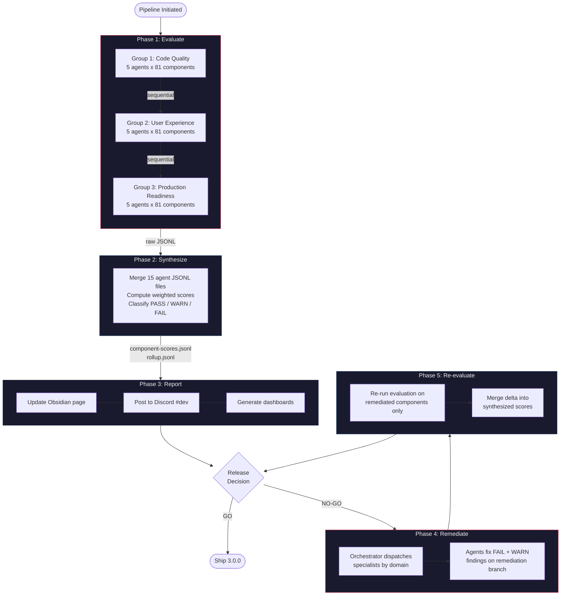
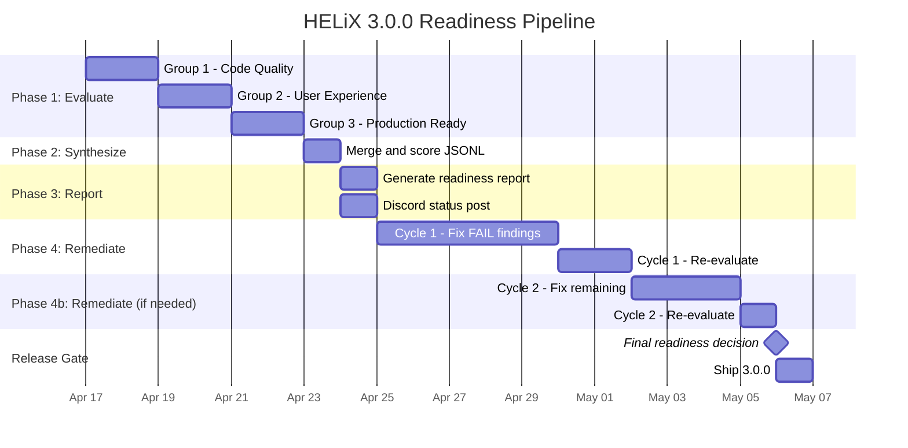

# HELiX 3.0.0 Readiness Pipeline

> **Status:** DRAFT | **Owner:** senior-product-manager-platform | **Created:** 2026-04-15
> **Pipeline definition:** `data/readiness/readiness-pipeline.yaml`
> **JSONL schema examples:** `data/readiness/readiness-schema.jsonl.example`

---

## Overview

HELiX 3.0.0 is a production-readiness release for enterprise healthcare infrastructure. Before shipping, every one of the 81 components must pass a structured evaluation across code quality, user experience, and production readiness -- conducted by 15 specialist agents organized into 3 evaluation groups.

This is not a checkbox exercise. Healthcare software failures can impact patient care. The bar is **unbreakable**.

---

## Pipeline Flow



---

## Evaluation Groups

### Group 1 -- Code Quality and Architecture

**Question answered:** "Is the code right?"

| Agent | Dimensions Evaluated | Rationale |
|-------|---------------------|-----------|
| **lit-specialist** | lit-patterns, shadow-dom-encapsulation, css-parts-api | Core Lit 3.x framework patterns, HelixElement base class, reactive properties, lifecycle correctness |
| **typescript-specialist** | type-safety, api-surface-typing, strict-compliance | Zero `any`, correct generics, ElementInternals typing, event type declarations |
| **principal-engineer** | architecture, composition-patterns, code-hygiene | Component boundaries, SRP, dependency graph, dead code, import hygiene |
| **code-reviewer** | code-style, file-structure, documentation, token-usage | Naming conventions, file layout compliance, JSDoc completeness, no hardcoded values |
| **senior-code-reviewer** | error-handling, event-contracts, slot-api-design, breaking-change-risk | Defensive coding, hx-* event prefix, --hx-* CSS props, slot design, semver risk |

**Total dimensions:** 17 | **Weight share:** ~35% of overall score

---

### Group 2 -- User Experience and Interaction

**Question answered:** "Does it work for users?"

| Agent | Dimensions Evaluated | Rationale |
|-------|---------------------|-----------|
| **accessibility-engineer** | aria-compliance, keyboard-navigation, focus-management, forced-colors-support | WCAG 2.1 AA (healthcare mandate), screen readers, keyboard-only, high-contrast mode |
| **storybook-specialist** | story-coverage, controls-completeness, interaction-tests, autodocs-accuracy | Storybook 10.x stories for all variants, CEM-driven controls, play functions |
| **qa-engineer-automation** | test-existence, test-coverage-pct, edge-case-coverage, test-quality | Vitest browser tests, coverage thresholds, negative testing, async behavior |
| **test-architect** | test-isolation, test-strategy, flaky-risk, category-coverage | Fixture patterns, shadow DOM queries, cleanup, test categorization |
| **design-system-developer** | token-integration, theming-api, cascade-correctness, dark-mode-support | Semantic tokens, component-level exposure, CSS cascade, dark mode |

**Total dimensions:** 20 | **Weight share:** ~40% of overall score (accessibility premium for healthcare)

---

### Group 3 -- Production and Ship Readiness

**Question answered:** "Can we ship it?"

| Agent | Dimensions Evaluated | Rationale |
|-------|---------------------|-----------|
| **performance-engineer** | bundle-size, render-performance, tree-shaking, dependency-weight | <5KB/component min+gz, <50KB total, render perf, unnecessary deps |
| **drupal-integration-specialist** | twig-compatibility, drupal-behaviors, cdn-readiness, no-js-fallback | Twig rendering, Drupal behaviors, CDN delivery, graceful degradation |
| **devops-engineer** | cem-accuracy, exports-config, changeset-readiness, ci-gate-status | CEM matches API, package.json exports, changeset state, CI green |
| **chief-code-reviewer** | api-consistency, naming-enforcement, api-freeze-readiness, semver-correctness | Cross-surface API review, naming conventions, public API freeze, versioning |
| **staff-software-engineer** | barrel-exports, monorepo-health, dev-experience, cross-package-deps | index.ts correctness, Turborepo health, HMR, cross-package deps |

**Total dimensions:** 20 | **Weight share:** ~25% of overall score

---

## Scoring System

### Scale and Thresholds

| Range | Status | Meaning |
|-------|--------|---------|
| **>= 80** | PASS | Ship-ready. Component meets production bar. |
| **60 -- 79** | WARN | Needs attention. May ship with explicit waiver and documented rationale. |
| **< 60** | FAIL | Must remediate before release. Blocks 3.0.0. |

### Aggregation Method

Each component receives a **weighted average** across all 57 dimensions. Weights reflect healthcare infrastructure priorities:

- **Accessibility dimensions** carry the highest individual weights (aria-compliance: 6, keyboard-navigation: 5)
- **Type safety** is the highest-weighted code quality dimension (weight: 5)
- **Bundle size** and **CEM accuracy** are the highest-weighted production dimensions (weight: 4 each)

Full weight table is in `data/readiness/readiness-pipeline.yaml` under `scoring.aggregation.weights`.

### Release Acceptance Criteria

All five conditions must be true for a GO decision:

| Criterion | Threshold |
|-----------|-----------|
| All components pass | Every component >= 80 |
| No critical findings | Zero severity=critical findings across all 81 components |
| Portfolio average | Average score across all components >= 85 |
| Maximum FAIL count | Zero FAIL components |
| Maximum WARN count | At most 5 WARN components (each requires written waiver) |

---

## JSONL Data Architecture

All pipeline data is stored as JSONL (JSON Lines) -- one valid JSON object per line. This format is chosen for:
- Append-only writes (agents can write concurrently without file locking)
- Streamable processing (no need to load entire dataset into memory)
- Git-diffable (each finding is a single line)
- Tooling compatibility (jq, Dataview, Obsidian plugins)

### File Layout

```
data/readiness/
  raw/
    code-quality-lit-specialist-findings.jsonl
    code-quality-typescript-specialist-findings.jsonl
    code-quality-principal-engineer-findings.jsonl
    code-quality-code-reviewer-findings.jsonl
    code-quality-senior-code-reviewer-findings.jsonl
    user-experience-accessibility-engineer-findings.jsonl
    user-experience-storybook-specialist-findings.jsonl
    user-experience-qa-engineer-automation-findings.jsonl
    user-experience-test-architect-findings.jsonl
    user-experience-design-system-developer-findings.jsonl
    production-readiness-performance-engineer-findings.jsonl
    production-readiness-drupal-integration-specialist-findings.jsonl
    production-readiness-devops-engineer-findings.jsonl
    production-readiness-chief-code-reviewer-findings.jsonl
    production-readiness-staff-software-engineer-findings.jsonl
  synthesized/
    component-scores.jsonl      # 81 lines, one per component
    rollup.jsonl                # 1 line per evaluation cycle
```

### Record Types

**Raw Finding** (written by agents):
```json
{
  "timestamp": "2026-04-16T09:12:34Z",
  "pipeline_id": "helix-3.0.0-readiness",
  "phase": "evaluate",
  "group_id": "user-experience",
  "agent_id": "accessibility-engineer",
  "component": "hx-select",
  "dimension": "aria-compliance",
  "score": 35,
  "severity": "critical",
  "status": "fail",
  "finding": "Missing aria-expanded on trigger button.",
  "evidence": "hx-select.ts:142",
  "remediation": "Add aria-expanded=${this.open} to trigger.",
  "tags": ["wcag-4.1.2"],
  "blocking": true,
  "effort_estimate": "small"
}
```

**Synthesized Score** (written by senior-product-manager-platform):
```json
{
  "timestamp": "2026-04-16T14:00:00Z",
  "pipeline_id": "helix-3.0.0-readiness",
  "component": "hx-button",
  "overall_score": 93,
  "status": "pass",
  "group_scores": {"code-quality": 95, "user-experience": 92, "production-readiness": 91},
  "dimension_scores": {"lit-patterns": 95, "type-safety": 96, "...": "..."},
  "finding_counts": {"critical": 0, "major": 1, "minor": 3, "info": 12},
  "blocking_count": 0,
  "top_issues": ["Slot API docs incomplete", "Edge case not tested"],
  "pass_dimensions": ["lit-patterns", "type-safety", "..."],
  "fail_dimensions": []
}
```

**Rollup** (written by senior-product-manager-platform):
```json
{
  "timestamp": "2026-04-16T14:30:00Z",
  "pipeline_id": "helix-3.0.0-readiness",
  "total_components": 81,
  "pass_count": 58, "warn_count": 15, "fail_count": 8,
  "average_score": 79, "median_score": 82,
  "lowest_score": 42, "lowest_component": "hx-data-table",
  "highest_score": 96, "highest_component": "hx-divider",
  "total_findings": 892, "critical_findings": 24, "blocking_findings": 24,
  "release_decision": "no-go",
  "conditions": ["8 FAIL components", "24 critical findings", "avg < 85"]
}
```

See `data/readiness/readiness-schema.jsonl.example` for full examples of all three record types.

---

## Component Status Tracker

> This table will be populated after Phase 1 (Evaluate) completes.
> Columns: Component | Overall | Code Quality | UX | Production | Status | Blocking | Top Issue

| Component | Overall | CQ | UX | PR | Status | Blocking | Top Issue |
|-----------|---------|----|----|----|----|----------|-----------|
| hx-accordion | -- | -- | -- | -- | pending | -- | -- |
| hx-action-bar | -- | -- | -- | -- | pending | -- | -- |
| hx-alert | -- | -- | -- | -- | pending | -- | -- |
| hx-avatar | -- | -- | -- | -- | pending | -- | -- |
| hx-badge | -- | -- | -- | -- | pending | -- | -- |
| hx-banner | -- | -- | -- | -- | pending | -- | -- |
| hx-breadcrumb | -- | -- | -- | -- | pending | -- | -- |
| hx-button | -- | -- | -- | -- | pending | -- | -- |
| hx-button-group | -- | -- | -- | -- | pending | -- | -- |
| hx-card | -- | -- | -- | -- | pending | -- | -- |
| hx-carousel | -- | -- | -- | -- | pending | -- | -- |
| hx-checkbox | -- | -- | -- | -- | pending | -- | -- |
| hx-checkbox-group | -- | -- | -- | -- | pending | -- | -- |
| hx-clinical-status | -- | -- | -- | -- | pending | -- | -- |
| hx-code-snippet | -- | -- | -- | -- | pending | -- | -- |
| hx-color-picker | -- | -- | -- | -- | pending | -- | -- |
| hx-combobox | -- | -- | -- | -- | pending | -- | -- |
| hx-container | -- | -- | -- | -- | pending | -- | -- |
| hx-copy-button | -- | -- | -- | -- | pending | -- | -- |
| hx-counter | -- | -- | -- | -- | pending | -- | -- |
| hx-data-table | -- | -- | -- | -- | pending | -- | -- |
| hx-date-picker | -- | -- | -- | -- | pending | -- | -- |
| hx-dialog | -- | -- | -- | -- | pending | -- | -- |
| hx-divider | -- | -- | -- | -- | pending | -- | -- |
| hx-drawer | -- | -- | -- | -- | pending | -- | -- |
| hx-dropdown | -- | -- | -- | -- | pending | -- | -- |
| hx-field | -- | -- | -- | -- | pending | -- | -- |
| hx-field-label | -- | -- | -- | -- | pending | -- | -- |
| hx-file-upload | -- | -- | -- | -- | pending | -- | -- |
| hx-form | -- | -- | -- | -- | pending | -- | -- |
| hx-format-date | -- | -- | -- | -- | pending | -- | -- |
| hx-grid | -- | -- | -- | -- | pending | -- | -- |
| hx-help-text | -- | -- | -- | -- | pending | -- | -- |
| hx-icon | -- | -- | -- | -- | pending | -- | -- |
| hx-icon-button | -- | -- | -- | -- | pending | -- | -- |
| hx-image | -- | -- | -- | -- | pending | -- | -- |
| hx-link | -- | -- | -- | -- | pending | -- | -- |
| hx-list | -- | -- | -- | -- | pending | -- | -- |
| hx-menu | -- | -- | -- | -- | pending | -- | -- |
| hx-meter | -- | -- | -- | -- | pending | -- | -- |
| hx-nav | -- | -- | -- | -- | pending | -- | -- |
| hx-number-input | -- | -- | -- | -- | pending | -- | -- |
| hx-overflow-menu | -- | -- | -- | -- | pending | -- | -- |
| hx-pagination | -- | -- | -- | -- | pending | -- | -- |
| hx-patient-banner | -- | -- | -- | -- | pending | -- | -- |
| hx-phi-field | -- | -- | -- | -- | pending | -- | -- |
| hx-popover | -- | -- | -- | -- | pending | -- | -- |
| hx-popup | -- | -- | -- | -- | pending | -- | -- |
| hx-progress-bar | -- | -- | -- | -- | pending | -- | -- |
| hx-progress-ring | -- | -- | -- | -- | pending | -- | -- |
| hx-prose | -- | -- | -- | -- | pending | -- | -- |
| hx-radio-group | -- | -- | -- | -- | pending | -- | -- |
| hx-rating | -- | -- | -- | -- | pending | -- | -- |
| hx-select | -- | -- | -- | -- | pending | -- | -- |
| hx-side-nav | -- | -- | -- | -- | pending | -- | -- |
| hx-skeleton | -- | -- | -- | -- | pending | -- | -- |
| hx-slider | -- | -- | -- | -- | pending | -- | -- |
| hx-spinner | -- | -- | -- | -- | pending | -- | -- |
| hx-split-button | -- | -- | -- | -- | pending | -- | -- |
| hx-split-panel | -- | -- | -- | -- | pending | -- | -- |
| hx-stack | -- | -- | -- | -- | pending | -- | -- |
| hx-stat | -- | -- | -- | -- | pending | -- | -- |
| hx-status-indicator | -- | -- | -- | -- | pending | -- | -- |
| hx-steps | -- | -- | -- | -- | pending | -- | -- |
| hx-structured-list | -- | -- | -- | -- | pending | -- | -- |
| hx-style-scope | -- | -- | -- | -- | pending | -- | -- |
| hx-switch | -- | -- | -- | -- | pending | -- | -- |
| hx-table | -- | -- | -- | -- | pending | -- | -- |
| hx-tabs | -- | -- | -- | -- | pending | -- | -- |
| hx-tag | -- | -- | -- | -- | pending | -- | -- |
| hx-text | -- | -- | -- | -- | pending | -- | -- |
| hx-text-input | -- | -- | -- | -- | pending | -- | -- |
| hx-textarea | -- | -- | -- | -- | pending | -- | -- |
| hx-theme | -- | -- | -- | -- | pending | -- | -- |
| hx-time-picker | -- | -- | -- | -- | pending | -- | -- |
| hx-toast | -- | -- | -- | -- | pending | -- | -- |
| hx-toggle-button | -- | -- | -- | -- | pending | -- | -- |
| hx-tooltip | -- | -- | -- | -- | pending | -- | -- |
| hx-top-nav | -- | -- | -- | -- | pending | -- | -- |
| hx-tree-view | -- | -- | -- | -- | pending | -- | -- |
| hx-visually-hidden | -- | -- | -- | -- | pending | -- | -- |

---

## Phase Timeline



**Estimated total duration:** 17--18 working days from pipeline start to ship decision.

| Phase | Duration | Notes |
|-------|----------|-------|
| Evaluate | ~6 days | Groups run sequentially; 5 agents parallel within each group |
| Synthesize | 1 day | Automated aggregation + manual review |
| Report | 1 day | Obsidian page update + Discord notification |
| Remediate (cycle 1) | 5 days | Specialist agents fix FAIL and critical WARN findings |
| Re-evaluate (cycle 1) | 2 days | Delta evaluation on changed components only |
| Remediate (cycle 2) | 3 days | Mop-up of remaining issues |
| Re-evaluate (cycle 2) | 1 day | Final delta check |
| Release gate | 0 days | GO / NO-GO / CONDITIONAL decision |

Maximum of 3 remediation cycles before escalation to human decision-maker.

---

## Execution Constraints

| Constraint | Value | Rationale |
|------------|-------|-----------|
| Group ordering | Sequential (1, 2, 3) | Later groups can reference earlier findings |
| Agent parallelism | Up to 5 within a group | Matches max_concurrent_agents |
| Agent timeout | 30 minutes | Escalate if exceeded |
| Zombie check | 20 minutes | Check for frozen agents |
| Max re-eval cycles | 3 | Prevent infinite remediation loops |
| Branch (evaluation) | `readiness/helix-3.0.0-eval` | Isolated from main dev work |
| Branch (remediation) | `readiness/helix-3.0.0-remediate` | Fixes committed here, then merged |
| Output directory | `data/readiness/` | Raw and synthesized JSONL |

---

## Acceptance Criteria for HELiX 3.0.0

The release ships when ALL of the following are true:

1. **Every component scores >= 80** (PASS). Zero FAIL components.
2. **Zero critical findings** across the entire 81-component portfolio.
3. **Portfolio average score >= 85.**
4. **At most 5 WARN components**, each with a written waiver documenting the accepted risk and remediation timeline.
5. **All 7 existing quality gates pass:** TypeScript strict, test suite (80%+ coverage), WCAG 2.1 AA, Storybook completeness, CEM accuracy, bundle size budgets, 3-tier code review.
6. **No blocking findings remain** (blocking_count = 0 for every component).
7. **Rollup release_decision = "go"** in the synthesized rollup JSONL.

If any criterion is not met after 3 remediation cycles, the pipeline escalates to the project owner (Jake) for a manual GO / NO-GO decision with full visibility into remaining gaps.

---

## Appendix: Dimension Reference

### Group 1 -- Code Quality (17 dimensions)

| Dimension | Weight | Agent | What 100 looks like |
|-----------|--------|-------|---------------------|
| lit-patterns | 4 | lit-specialist | Perfect Lit 3.x idioms, HelixElement base class, clean lifecycle |
| shadow-dom-encapsulation | 3 | lit-specialist | Zero style leaks, proper slot isolation |
| css-parts-api | 2 | lit-specialist | All visual elements exposed via CSS Parts |
| type-safety | 5 | typescript-specialist | Zero `any`, all public API strongly typed |
| api-surface-typing | 3 | typescript-specialist | Events, properties, methods have full type declarations |
| strict-compliance | 3 | typescript-specialist | No @ts-ignore, no non-null assertions |
| architecture | 4 | principal-engineer | Clean SRP, correct component boundaries |
| composition-patterns | 3 | principal-engineer | Proper slot-based composition, no tight coupling |
| code-hygiene | 2 | principal-engineer | Zero dead code, clean imports |
| code-style | 2 | code-reviewer | Consistent naming, formatting |
| file-structure | 2 | code-reviewer | index.ts + .ts + .styles.ts + .stories.ts + .test.ts |
| documentation | 2 | code-reviewer | JSDoc on all public members |
| token-usage | 3 | code-reviewer | Zero hardcoded colors/spacing/typography |
| error-handling | 3 | senior-code-reviewer | All error paths handled |
| event-contracts | 3 | senior-code-reviewer | hx-* prefix, correct detail types |
| slot-api-design | 2 | senior-code-reviewer | Named slots documented, fallback content |
| breaking-change-risk | 4 | senior-code-reviewer | No unversioned breaking changes |

### Group 2 -- User Experience (20 dimensions)

| Dimension | Weight | Agent | What 100 looks like |
|-----------|--------|-------|---------------------|
| aria-compliance | 6 | accessibility-engineer | Full WCAG 2.1 AA ARIA implementation |
| keyboard-navigation | 5 | accessibility-engineer | All functionality keyboard-operable |
| focus-management | 4 | accessibility-engineer | Focus visible, trapped in modals, restored on close |
| forced-colors-support | 3 | accessibility-engineer | Fully usable in Windows High Contrast |
| story-coverage | 3 | storybook-specialist | Stories for every variant and state |
| controls-completeness | 2 | storybook-specialist | All public props have Storybook controls |
| interaction-tests | 3 | storybook-specialist | Play functions for interactive behaviors |
| autodocs-accuracy | 2 | storybook-specialist | Autodocs match CEM exactly |
| test-existence | 4 | qa-engineer-automation | .test.ts file exists with meaningful tests |
| test-coverage-pct | 3 | qa-engineer-automation | >= 80% branch coverage |
| edge-case-coverage | 3 | qa-engineer-automation | Empty state, overflow, rapid interaction tested |
| test-quality | 2 | qa-engineer-automation | Assertions are specific, not just "renders" |
| test-isolation | 2 | test-architect | No test-to-test dependencies |
| test-strategy | 2 | test-architect | Mix of unit/integration/visual tests |
| flaky-risk | 2 | test-architect | No timing-dependent or order-dependent tests |
| category-coverage | 1 | test-architect | All test categories represented |
| token-integration | 3 | design-system-developer | All visual properties use design tokens |
| theming-api | 2 | design-system-developer | Component-level tokens with semantic fallbacks |
| cascade-correctness | 2 | design-system-developer | Primitive -> Semantic -> Component cascade works |
| dark-mode-support | 1 | design-system-developer | Dark mode renders correctly |

### Group 3 -- Production Readiness (20 dimensions)

| Dimension | Weight | Agent | What 100 looks like |
|-----------|--------|-------|---------------------|
| bundle-size | 4 | performance-engineer | < 5KB min+gz |
| render-performance | 3 | performance-engineer | First render < 16ms, no layout thrash |
| tree-shaking | 2 | performance-engineer | Unused code eliminated by bundlers |
| dependency-weight | 2 | performance-engineer | No unnecessary runtime dependencies |
| twig-compatibility | 3 | drupal-integration-specialist | Renders correctly in Twig templates |
| drupal-behaviors | 2 | drupal-integration-specialist | Drupal.behaviors attachment works |
| cdn-readiness | 2 | drupal-integration-specialist | Works via CDN script tag |
| no-js-fallback | 1 | drupal-integration-specialist | Graceful degradation without JS |
| cem-accuracy | 4 | devops-engineer | custom-elements.json matches code exactly |
| exports-config | 3 | devops-engineer | package.json exports correct for all entry points |
| changeset-readiness | 2 | devops-engineer | Changeset exists with correct bump type |
| ci-gate-status | 3 | devops-engineer | All 7 quality gates green |
| api-consistency | 3 | chief-code-reviewer | Naming patterns consistent across all 81 components |
| naming-enforcement | 2 | chief-code-reviewer | hx-* tags, --hx-* props, hx-* events |
| api-freeze-readiness | 2 | chief-code-reviewer | Public API stable, no pending changes |
| semver-correctness | 2 | chief-code-reviewer | Version bump matches change type |
| barrel-exports | 2 | staff-software-engineer | index.ts re-exports are complete and correct |
| monorepo-health | 1 | staff-software-engineer | Turborepo pipeline correct |
| dev-experience | 1 | staff-software-engineer | HMR works, dev server stable |
| cross-package-deps | 2 | staff-software-engineer | No circular or phantom dependencies |

---

## Remediation Routing

When a finding requires remediation, the orchestrator routes to the appropriate specialist based on the finding's `group_id` and `dimension`:

| Finding Domain | Primary Remediation Agent | Backup |
|---------------|--------------------------|--------|
| Lit patterns, Shadow DOM | lit-specialist | frontend-specialist |
| TypeScript, types | typescript-specialist | lit-specialist |
| Architecture, composition | principal-engineer | staff-software-engineer |
| Code style, docs, tokens | code-reviewer | design-system-developer |
| Error handling, events, slots | senior-code-reviewer | lit-specialist |
| ARIA, keyboard, focus | accessibility-engineer | frontend-specialist |
| Storybook stories, controls | storybook-specialist | qa-engineer-automation |
| Tests, coverage | qa-engineer-automation | test-architect |
| Test infrastructure | test-architect | qa-engineer-automation |
| Design tokens, theming | design-system-developer | css3-animation-purist |
| Bundle size, performance | performance-engineer | staff-software-engineer |
| Drupal compatibility | drupal-integration-specialist | frontend-specialist |
| CEM, exports, CI | devops-engineer | staff-software-engineer |
| API consistency, naming | chief-code-reviewer | senior-code-reviewer |
| Barrel exports, monorepo | staff-software-engineer | devops-engineer |

---

## Revision History

| Date | Change | Author |
|------|--------|--------|
| 2026-04-15 | Initial pipeline design | senior-product-manager-platform |
